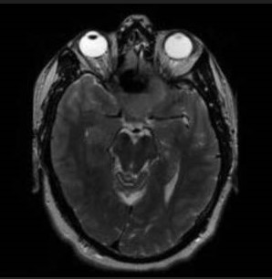
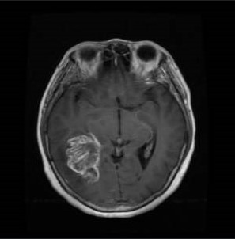
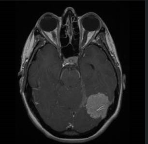
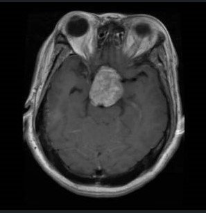
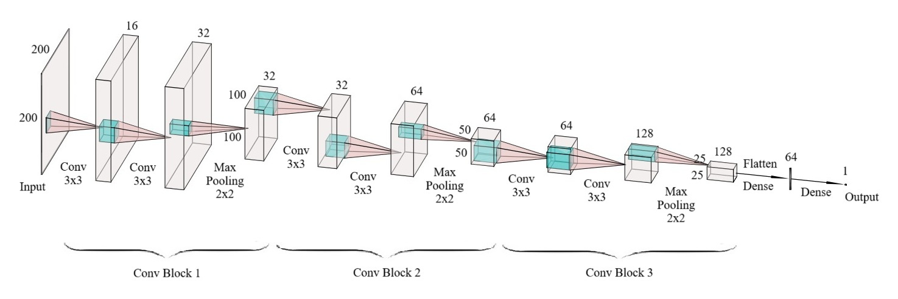
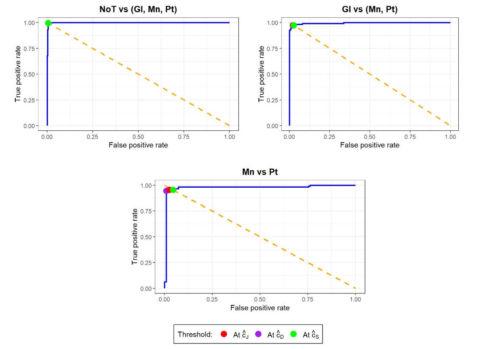
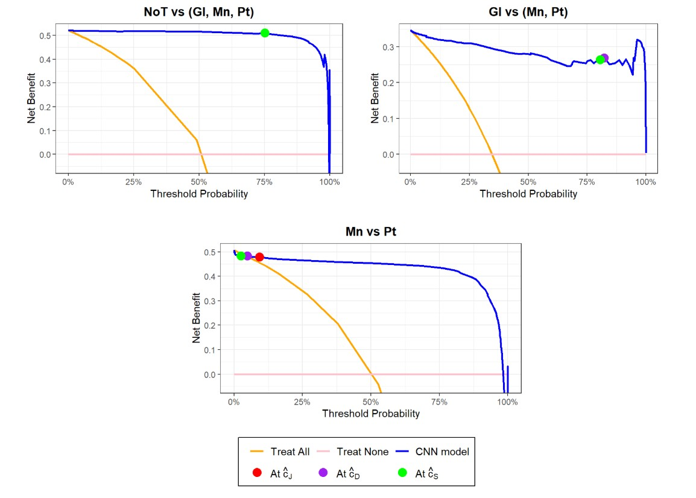

# Brain Tumor MRI Image Classification Using a OvF Strategy with CNNs

## Overview

Brain tumors are abnormal growths of cells within or surrounding the brain and can be either benign or malignant. Magnetic Resonance Imaging (MRI) is one of the most commonly used imaging modalities for brain tumor diagnosis due to its high soft-tissue contrast and detailed anatomical information.

Brain tumor diagnosis from MRI scans is a multi-class classification problem that plays a critical role in clinical decision-making. Conventional deep learning approaches typically address this task using standard multi-class classification models. However, in medical diagnosis, models are usually evaluated through Receiver Operating Characteristic (ROC) Curve Analysis and Decision Curve Analysis (DCA), and each model's predictions are typically based on a classification threshold. These evaluation methods and decision rules are inherently defined for binary classification problems. Therefore, instead of using one single multi-class classification model, this study used the **One-vs-Followers (OvF) approach** to decompose the original multi-class problem into a sequence of binary classification tasks in order to enable the integration of ROC Curve Analysis, DCA, and optimal classification thresholds.

This project implements a OvF approach combined with Convolutional Neural Networks (CNNs) to automatically classify brain tumor status using axial slices from brain MRI images as part of my master's thesis. The original task is formulated as a multi-class image classification problem, distinguishing between 4 brain tumor categories: *No tumor, Glioma, Meningioma,* and *Pituitary tumor*. This study aims to develop a deep learning–based approach that can assist in brain tumor scanning by improving diagnostic efficiency and consistency. The code was developed and executed using RStudio.

## Data

This project uses the Brain Tumor MRI dataset, which contains 7023 brain MRI images across multiple slice orientations (*axial, coronal, sagittal*), collected from individuals undergoing diagnostic evaluation. The images are divided into 4 classes: *NoTumor, Glioma, Meningioma,* and *Pituitary*. The dataset is publicly available at: <https://www.kaggle.com/datasets/masoudnickparvar/brain-tumor-mri-dataset>

For model training and evaluation, only the axial slices were used, comprising a total of 3,569 images.

   

***Figure 1:** Axial images from the four classes: NoTumor, Glioma, Meningioma and Pituitary*

Among the axial images in the dataset, 1026 images are in grayscale format and the remaining 2543 are in RGB format. Standard MRI images are inherently black and white. Therefore, the RGB images were converted to grayscale to ensure consistency, without loss of relevant information.

The axial images have heights ranging from 168 to 2376 pixels and widths ranging from 150 to 1920 pixels. All these images were resized to 200 $\times$ 200 pixels using bicubic interpolation. To preserve the original aspect ratio during resizing, black padding was applied along the edges of the images.

The axial images were split into training, validation, and test sets following a 70:10:20 ratio. Because pixel values in the training set already lie within the range [0, 1], no additional image normalization was required.

## Methods

In medical diagnosis, model performance is commonly assessed using ROC Curve Analysis and DCA. Additionally, model predictions are typically generated based on a classification threshold. These evaluation methods and decision rules are inherently defined for binary classification problems. As a result, instead of using a single multi-class model for the original task, this project reformulated the multi-class problem as a sequence of binary classification tasks. To accomplish this, OvR was first considered.

#### OvR approach

> ***One-vs-Rest (OvR)** is a strategy for transforming a k-class classification problem into k binary classification problems. Each binary problem distinguishes one class (positive) from all remaining classes (negative). For each binary problem, a corresponding binary classifier is trained.*
>
> *During prediction, for a given observation, each binary classifier outputs the probability that the observation belongs to its positive class. The final prediction is the class with the highest predicted probability.*

While OvR is widely used, it doesn't naturally incorporate classification thresholds, since the final decision is based on comparing probabilities across models rather than thresholding individual classifiers. This limitation makes OvR less suitable for medical diagnosis tasks that rely on optimal classification thresholds. By contrast, OvF allows optimal classification thresholds to be applied directly during decision making, which makes it particularly suitable for medical diagnosis tasks. Therefore, OvF was adopted in this project to transform the original multi-class problem into multiple binary problems.

#### OvF approach

> ***One-vs-Followers (OvF)** is a sequential variant of OvR that transforms a k-class classification problem into k-1 binary classification problems as follows:*
>
> 1.  *Considering all classes from the original multi-class problem, construct a binary problem with one class as the positive class and all remaining classes as the negative class.*
>
> 2.  *Considering the classes in the negative group of the previous binary problem, construct the next binary problem with one class as the positive class and the remaining classes as the negative class.*
>
> 3.  *Repeat Step 2 until only one class remains in the negative group of the previous binary problem.*
>
> *For each binary problem, a corresponding binary classifier is trained.*
>
> *During prediction, the binary classifiers are applied sequentially in the order they were constructed. For a given observation, the first binary classifier outputs the probability that the observation belongs to its positive class. This probability is then compared against the classifier's optimal classification threshold:*
>
> 1.  *If the probability exceeds the threshold, the observation is assigned to that classifier’s positive class and the prediction process stops.*
> 2.  *Otherwise, the next binary classifier in the sequence is evaluated in the same manner.*
>
> *If no classifier’s predicted probability surpasses its optimal threshold, the observation is assigned to the negative class of the final binary model.*

By applying the OvF approach, we obtained the following binary problems:

- Classification of the NoTumor class against the other 3 classes, hereafter referred to as the NoT vs (Gl, Mn, Pt) problem;

- Classification of the Glioma class against the Meningioma and Pituitary classes, hereafter referred to as the Gl vs (Mn, Pt) problem;

- Classification of the Meningioma class against the Pituitary class, hereafter referred to as the Mn vs Pt problem.

Next, the original training, validation, and test sets were transformed for each OvF binary classification task. Specifically:

- For the NoT vs (Gl, Mn, Pt) problem, all images were retained. The NoTumor class was treated as the positive class, while the remaining 3 classes were grouped into the negative class.

- For the Gl vs (Mn, Pt) problem, images belonging to the NoTumor class was removed. The Glioma class was treated as the positive class, while the Meningioma and Pituitary classes were grouped into the negative class.

- For the Mn vs Pt problem, images belonging to the NoTumor and Glioma classes were removed. The Meningioma class was treated as the positive class, while the Pituitary class was treated as the negative class.

Three CNN models were built using Tensorflow, each corresponding to one of the three OvF binary problems. The structure of each model is built following these steps:

- A sequential model was initialized, with the input defined as a grayscale image of 200 $\times$ 200 pixels.

- Feature extraction is performed using 6 convolutional layers organized into 3 convolutional blocks, with increasing numbers of filters (16, 32, 32, 64, 64, and 128). All convolutional layers use 3 $\times$ 3 kernels, followed by batch normalization and ReLU activation. Max pooling layers with a 2 $\times$ 2 pool size and dropout layers with a dropout rate of 0.2 are added at the end of every convolutional block.

- The extracted feature maps are flattened using a flatten layer and passed to a fully connected (FC) layer with 64 units, followed by batch normalization, ReLU activation, and a dropout layer with a dropout rate of 0.4.

- Finally, the output layer is defined as a FC layer with 1 unit and sigmoid activation, producing a probability score that indicates the likelihood that an input image belongs to the positive class of the current OvF problem.

***Figure 2:** Architecture of the CNN model*

All OvF models were trained using the Stochastic Gradient Descent (SGD) optimizer with a momentum of 0.8 and Binary Cross-Entropy (BCE) as the loss function. Model performance was monitored using Area Under the ROC Curve (AUC) and loss on both the training and validation sets across all epochs. Training was performed with a batch size of 16 for all models.

The learning rate was set to 0.01 for the NoT vs (Gl, Mn, Pt) model and 0.005 for both the Gl vs (Mn, Pt) and Mn vs Pt models. The number of epochs was set to 10, 20, and 25 for these three models, respectively.

The final OvF models were evaluated using ROC curve, Decision curve and Area Under the ROC Curve (AUC). Afterwards, the three ROC - based criteria and the net benefit function were used to find the optimal classification threshold for each OvF model.

#### ROC curve and AUC

> *The Receiver Operating Characteristic curve (**ROC curve**) is a plot of sensitivity against 1 - specificity across different classification thresholds and is used to evaluate the performance of a binary classification model. A ROC curve closer to the top-left corner indicates better classification performance.*
>
> *The Area Under the ROC Curve (**AUC**) is a standard metric for evaluating binary classification performance, with values closer to 1 indicating stronger discriminative ability and 0.5 corresponding to random guessing.*

#### Decision curve

> ***Decision curve** is a plot of the net benefit as a function of the classification threshold and is used to evaluate the clinical utility of a binary classification model. In Decision Curve Analysis (DCA), two default treatment strategies—“Treat none” and “Treat all”—are used as reference baselines for comparison with predictive models.*

#### Classification threshold

> *In medical diagnosis with binary disease classification, the diagnostic outcome distinguishes between diseased and non-diseased individuals. A predictive model estimates the probability that a patient has the disease based on their clinical features. A **classification threshold** is then used to convert this probability into a diagnostic decision: patients with predicted probabilities above the threshold are classified as positive (diseased), while those below the threshold are classified as negative (non-diseased).*

#### Optimal threshold selection

> *To select the best classification threshold for a predictive model, three ROC-based criteria are first used to identify candidate optimal thresholds in terms of classification performance:*
>
> 1.  ***Maximizing Youden Index criterion**, which selects the threshold* $\hat{c}_{J}$ *that maximizes the sum of sensitivity and specificity;*
>
> 2.  ***Closest to (0, 1) criterion**, which selects the threshold* $\hat{c}_{D}$ *that is closest to perfect classification on the ROC space;*
>
> 3.  ***Symmetry Point criterion**, which selects the threshold* $\hat{c}_{S}$ *at which sensitivity equals specificity.*
>
> *These thresholds are then evaluated using DCA, which assesses clinical utility through net benefit. The final **optimal classification threshold** is selected as the one that provides the highest net benefit among the candidates.*

## Results

***Figure 3:** ROC curves of the 3 OvF models on their corresponding test sets*

***Figure 4:** Decision curves of the 3 OvF models on their corresponding test sets*

The ROC curves of all 3 OvF models on their corresponding test sets lie close to the top-left corner, indicating strong classification performance. Furthermore, according to the Decision curves of the OvF models on their corresponding test sets, all 3 OvF models provide a higher net benefit than both the “Treat all” and “Treat none” strategies across most classification thresholds, reflecting high clinical utility.

|      OvF model      | Training AUC | Test AUC |
|:-------------------:|:------------:|:--------:|
| NoT vs (Gl, Mn, Pt) |    0.9999    |  0.9980  |
|   Gl vs (Mn, Pt)    |    0.9999    |  0.9955  |
|      Mn vs Pt       |    1.0000    |  0.9733  |

***Table 1:** AUC values ​​of each OvF model on the training and test sets*

The difference in AUC between the training and test sets is negligible for the first two OvF models, and is also relatively small for the Mn vs Pt model. This indicates that none of the binary models showed signs of overfitting. In addition, the AUC values ​​of all 3 OvF models on their corresponding test sets demonstrate excellent classification performance.

| OvF model | Maximizing Youden Index Threshold | Closest to (0,1) Threshold | Symmetry Point Threshold |
|:--:|:--:|:--:|:--:|
| NoT vs (Gl, Mn, Pt) | 0.7513 | 0.7513 | 0.7513 |
| Gl vs (Mn, Pt) | 0.8227 | 0.8227 | 0.8052 |
| Mn vs Pt | 0.0928 | 0.0482 | 0.0251 |

***Table 2:** Candidate optimal thresholds for each OvF model based on three criteria*

Candidate optimal thresholds for each OvF model were computed using 3 criteria: *Maximizing Youden Index criterion, Closest to (0, 1) criterion, and Symmetry Point criterion.*

- *NoT vs (Gl, Mn, Pt):* All three candidate thresholds for the model are equal to 0.7513. Therefore, the threshold of 0.7513 is the model's final optimal classification threshold.

- *Gl vs (Mn, Pt):* Among the candidate thresholds for the model, the threshold of 0.8227 provides the highest net benefit and is therefore selected as the model's final optimal classification threshold.

- *Mn vs Pt:* Among the candidate thresholds for the model, the threshold of 0.0251 yields the highest net benefit and is therefore selected as the model's final optimal classification threshold.

## References

[1] Sande, S. Z., Seng, L., Li, J., & D’Agostino, R. (2021). Statistical Learning in Medical Research with Decision Threshold and Accuracy Evaluation. *Journal of Data Science, 19(4),* 634-657. <https://doi.org/10.6339/21-JDS1022>

[2] Kim, K.-j., & Ahn, H. (2012). A corporate credit rating model using multi-class support vector machines with an ordinal pairwise partitioning approach. *Computers & Operations Research, 39(8)*, 1800-1811. <https://doi.org/10.1016/j.cor.2011.06.023>
